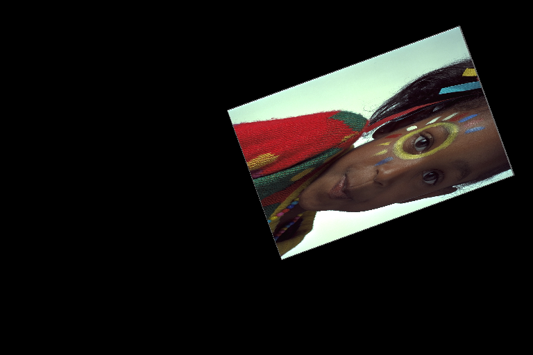

Usage examples
==============

Every affine transformation is build from 4 :class:`~pillow_affine.transforms.ElementaryTransform` s:

- :class:`~pillow_affine.transforms.Shear`
- :class:`~pillow_affine.transforms.Rotate`
- :class:`~pillow_affine.transforms.Scale`
- :class:`~pillow_affine.transforms.Translate`

To create a more complex transformation these
:class:`~pillow_affine.transforms.ElementaryTransform` s can be chained together
with a :class:`~pillow_affine.transforms.ComposedTransform`

The following examples showcase the functionality of ``pillow_affine`` based on
the following image:

.. note::
  The above image can be downloaded `here <http://www.r0k.us/graphics/kodak/>`_
  and is cleared for unrestricted usage.

:class:`~pillow_affine.transforms.Shear`
----------------------------------------

.. code-block:: python

  from pillow_affine import Shear

  transform1 = Shear(30.0)
  transform2 = Shear(30.0, clockwise=True)
  transform3 = Shear(30.0, center=(0.0, 0.0))

.. image:: _static/images/shear.png
  :width: 225
  :alt: Shear(30.0)

:class:`~pillow_affine.transforms.Rotate`
-----------------------------------------

.. code-block:: python

  from pillow_affine import Rotate

  transform1 = Rotate(30.0)
  transform2 = Rotate(30.0, clockwise=True)
  transform3 = Rotate(30.0, center=(0.0, 0.0))

:class:`~pillow_affine.transforms.Scale`
----------------------------------------

.. code-block:: python

  from pillow_affine import Scale

  transform1 = Scale(2.0)
  transform2 = Scale((0.3, 1.0))
  transform3 = Scale(0.5, center=(0.0, 0.0))

.. image:: _static/images/scale_async.png
  :width: 225
  :alt: Scale((0.3, 1.0))

:class:`~pillow_affine.transforms.Translate`
--------------------------------------------

.. code-block:: python

  from pillow_affine import Translate

  transform1 = Translate((100.0, 50.0))
  transform2 = Translate((100.0, 50.0), inverse=True)

:class:`~pillow_affine.transforms.ComposedTransform`
----------------------------------------------------

.. code-block:: python

  from pillow_affine import Shear, Rotate, Scale, Translate, ComposedTransform

  transform1 = ComposedTransform(
      Shear(45.0),
      Rotate(30.0),
      Scale(0.7),
  )
  transform2 = ComposedTransform(
      Scale((0.3, 0.7)),
      Rotate(70.0, clockwise=True),
      Translate((50.0, 20.0))
  )

``expand``
----------

.. code-block:: python

  from pillow_affine import Shear

  transform = Shear(30.0)
  transform_params1 = transform.extract_transform_params(size)
  transform_params2 = transform.extract_transform_params(size, expand=True)

.. image:: _static/images/shear.png
  :width: 225
  :alt: Shear(30.0)

